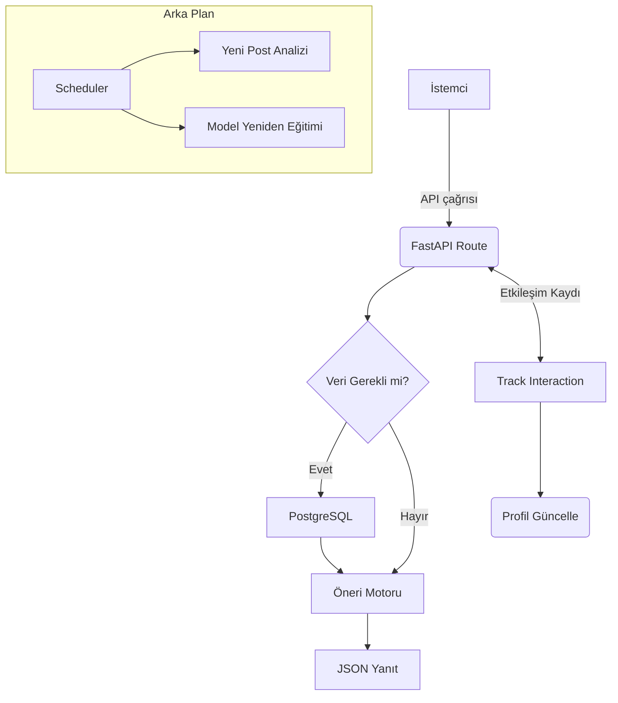

## Redit Feed Recommendation Sistemi - Nasıl Çalışır?

Bu belge, projeyi **"kod okumaya gerek kalmadan"** anlayabilmeniz için hazırlanmıştır. Her adım basit dille anlatılmış, teknik terimler ise dosyanın sonunda sözlük şeklinde açıklanmıştır.

---

### 1. Kurulum ve Başlatma Adımları

1. Depoyu klonla ve sanal ortamı kur:
   ```bash
   git clone <repo-url>
   cd redit-feed
   python -m venv venv && source venv/bin/activate
   pip install -r requirements.txt
   ```
2. `.env` içindeki veritabanı ayarlarını gir.
3. Sunucuyu başlat:
   ```bash
   uvicorn app.main:app --reload
   ```

> Sunucu ayağa kalktığında arka planda veritabanına bağlanır, öneri modeli yüklenir ve zamanlayıcı tetiklenir.

---

### 2. Yüksek Seviyede Akış (Özet)

1. **İstemci** (web / mobil) API'den veri ister.
2. **FastAPI Uygulaması** isteği karşılar → ilgili **route** fonksiyonuna yönlendirir.
3. Route:
   - Veritabanından gerekli veriyi çeker.
   - Gerekirse **Gelişmiş Öneri Motoru**nu kullanarak sonuç üretir.
4. Sonuç JSON olarak istemciye döner.
5. Kullanıcı etkileşimi (görüntüleme, beğeni, yorum…) olduğunda `POST /track-interaction` çağrılır; model anlık güncellenir.
6. **Scheduler** arka planda periyodik analiz & yeniden eğitim görevlerini koşturur.

---

### 3. Katmanlar ve Görevleri

| Katman | Dosya / Modül | Ne İş Yapar? |
| ------ | ------------- | ------------ |
| **Uygulama** | `app/main.py` | FastAPI uygulamasını başlatır, CORS ayarları, açılış/kapanış event'leri yönetir. |
| **API (Routes)** | `app/routes.py` | Tüm HTTP uç noktalarını tanımlar. Öneri, analiz, etkileşim kaydı vb. |
| **Veritabanı** | `app/db.py` | PostgreSQL'e asenkron bağlantı kurar. |
| **İçerik Analizi** | `app/content_analyzer.py` | Post başlık+metnini temizler, anahtar kelimeler çıkarır, K-Means ile kümeleme yapar. |
| **Etiket Özellikleri** | `app/features.py` | Post etiketlerini TF-IDF vektörlerine dönüştürür. |
| **Öneri Motoru** | `app/enhanced_recommender.py` | İçerik analiz sonuçlarını ve kullanıcı etkileşimlerini kullanarak kişiselleştirilmiş öneriler üretir. |
| **Scheduler** | `app/scheduler.py` | "Yeni post analizi" (3 saatte bir) ve "Model yeniden eğitimi" (her gece 02:00) görevlerini çalıştırır. |

---

### 4. Öneri Nasıl Hesaplanır?

1. **Modeli Eğitme:** 
   - Postlar veritabanından çekilir.
   - İçerik analizi ile *geliştirilmiş etiket listesi* üretilir.
   - Tüm etiketler TF-IDF vektörlerine dönüştürülür → `feature_matrix`.
   - `user_tag_interactions` tablosundan kullanıcı tercihlerine dair istatistikler yüklenir.

2. **Kullanıcı Profili Oluşturma:** 
   - Her etkileşim türü (view/like/comment/share) farklı ağırlığa sahiptir.
   - Etkileşimler, ilgili postun etiketlerine puan ekler → kullanıcı **tag_preferences** haritası.

3. **Öneri Üretme:**
   - Kullanıcının görmediği postlar filtrelenir.
   - Kullanıcı tag vektörü ile tüm post vektörleri arasındaki **kosinüs benzerliği** hesaplanır.
   - Yüksek puanlı ilk *N* post, açıklama sebebiyle birlikte döndürülür.

---

### 5. Periyodik Görevler

| Görev | Süre/Plan | Ne Yapılır? |
| ----- | --------- | ----------- |
| Yeni Post Analizi | 3 saatte bir | Son 3 saatin post'ları içerik analizinden geçirir, `feature_matrix` günceller. |
| Model Yeniden Eğitimi | Her gece 02:00 | Tüm veriyi baştan okur, modeli sıfırdan eğitir. |

---

### 6. Akış Şeması



---

### 7. Terimler Sözlüğü

| Terim | Açıklama |
| ----- | -------- |
| **FastAPI** | Python ile yazılmış, yüksek performanslı web çatı sistemi. |
| **TF-IDF** | *Term Frequency–Inverse Document Frequency*; kelime önemini ölçen istatistik. |
| **K-Means** | Veri noktalarını *k* adet kümeye ayıran makine öğrenmesi algoritması. |
| **Kosinüs Benzerliği** | İki vektör arasındaki açısal benzerlik metriği (1 = tıpatıp aynı). |
| **Scheduler (schedule.py)** | Zamanlanmış görevleri belirli periyotlarda çalıştıran yapı. |
| **CORS** | *Cross-Origin Resource Sharing*; tarayıcıların farklı origin'lere istek yapma kısıtını ayarlar. |
| **JSON** | *JavaScript Object Notation*; veri alış-verişinde yaygın metin formatı. |
| **PostgreSQL** | Açık kaynaklı ilişkisel veritabanı sistemi. |
| **API Endpoint** | Uygulamada erişilebilen belirli HTTP yol ve metot kombinasyonu. |
| **Etiket (Tag)** | Postu tanımlayan anahtar kelime. |
| **Feature Matrix** | Her satırı post, her sütunu özelliği temsil eden sayısal matris. |
| **Model Yeniden Eğitimi** | Veriler güncellendikçe modelin sıfırdan tekrar oluşturulması işlemi. |
| **View/Like/Comment/Share** | Kullanıcı etkileşim türleri; modele farklı ağırlıklarla yansır. |
